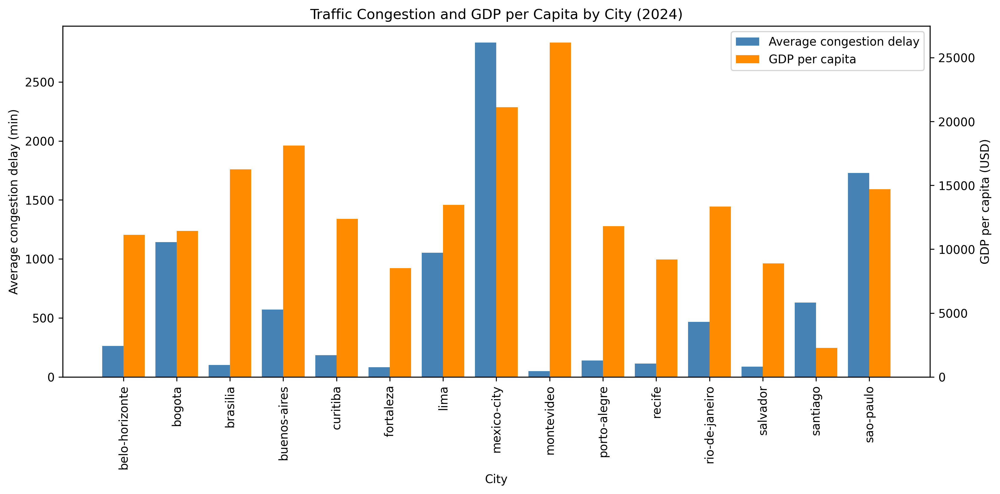

# Urban Mobility and Economic Productivity Analysis

This project explores the relationship between urban mobility indicators and economic performance across major Latin American cities during 2024. By integrating traffic and economic datasets, the analysis examines whether patterns of congestion are associated with differences in economic productivity and identifies cities that may warrant further infrastructure assessment.

> **Academic Project**  
> This project was developed for educational purposes as part of a simulated business case. The role, business scenario, and recommendations are intended to demonstrate a data analytics workflow and should not be interpreted as official guidance for the organizations referenced.

---

## 📌 Project Overview

Efficient urban mobility plays an important role in economic activity by influencing travel times, accessibility, and productivity. This project combines traffic information from TomTom with urban economic indicators from the OECD to build an integrated dataset for comparative city-level analysis.

The analysis focuses on 2024 data covering 15 cities across seven Latin American countries, producing a clean dataset and a set of exploratory visualizations to support descriptive insights.

---

## 🏢 Business Context

In this simulated business case, the American Development Bank seeks to better understand how urban congestion relates to economic productivity when evaluating potential transportation infrastructure investments.

The objective is not to establish causal relationships, but to identify patterns that may support further policy evaluation and investment prioritization.

---

## 🎯 Analysis Objective

### Main Objective

Analyze the relationship between urban traffic congestion and selected economic indicators by integrating mobility and economic datasets into a unified analytical dataset.

### Analysis Questions

- Which cities combine high congestion with relatively lower economic performance?
- Which cities present stronger economic indicators alongside more efficient mobility?
- Do the available data suggest observable relationships between traffic conditions and urban productivity?

---

## 📊 Data Sources

### Data availability

The original raw datasets are not included in this repository due to file size limitations. The cleaned and integrated dataset generated during the analysis is available in datasets/clean/, while the complete data preparation and integration workflow remains documented in the notebook.

### TomTom Traffic Index

Provides real-time urban mobility indicators, including congestion levels, traffic delays, travel times, and traffic intensity for monitored cities.

### OECD City Economy

Provides annual city-level economic indicators, including GDP per capita, unemployment rate, population, and PM2.5 concentration.

---

## 🛠️ Analysis Process

- Loaded and inspected both datasets.
- Standardized column names and corrected data types.
- Filtered records to the 2024 analysis period.
- Aggregated traffic observations into annual city-level averages.
- Integrated mobility and economic datasets using city and year as matching keys.
- Performed exploratory data analysis through descriptive visualizations.
- Exported the final processed dataset for future analysis.

---

## 🔍 Key Findings

### No clear visual relationship between congestion and GDP per capita

The exploratory analysis did not reveal a clear visual relationship between traffic congestion and GDP per capita. Cities with stronger economic performance displayed varying congestion levels, suggesting that additional factors may influence urban mobility.



### Mexico City stands out as a notable outlier

Mexico City showed substantially higher average traffic delay than the remaining cities in the dataset. This makes it an interesting candidate for more detailed, city-specific analysis.

### Different mobility profiles exist among economically strong cities

Some cities combine relatively high economic performance with lower congestion, while others experience both strong economic indicators and significant traffic delays. This highlights the diversity of urban mobility conditions across the region.

### Cities with high congestion and lower GDP may deserve further assessment

Cities such as Bogotá and Lima exhibit comparatively high congestion alongside lower GDP per capita than several other cities included in the analysis. While this does not imply causation, these cases could be prioritized for additional evaluation.

---

## 💡 Recommendations

- Expand the analysis to multiple years to evaluate whether the observed patterns remain consistent over time.
- Complement the exploratory analysis with statistical techniques to quantify relationships between variables.
- Evaluate additional urban indicators, such as public transportation availability or road infrastructure, to obtain a broader understanding of mobility performance.
- Prioritize detailed city-level assessments before drawing investment conclusions.

---

## ⚠️ Analysis Limitations

- The analysis is limited to a single year (2024).
- The dataset includes only 15 cities from seven Latin American countries.
- Findings are descriptive and based primarily on exploratory visualizations.
- The analysis does not establish causal relationships between mobility and economic performance.

---

## 📁 Repository Structure

```text
.
├── README.md
├── analysis_mobility_and_economy.ipynb
├── datasets/
│   └── clean/
│       └── mobility_economy_2024_clean.csv
└── images/
    └── congestion_gdp_comparison.png
```

---

## 💻 Tools and Technologies

- Python
- pandas
- NumPy
- Matplotlib
- Seaborn
- Jupyter Notebook

---

## 👤 Author

**Edgar Rojas**

*Data Analytics Portfolio Project*
